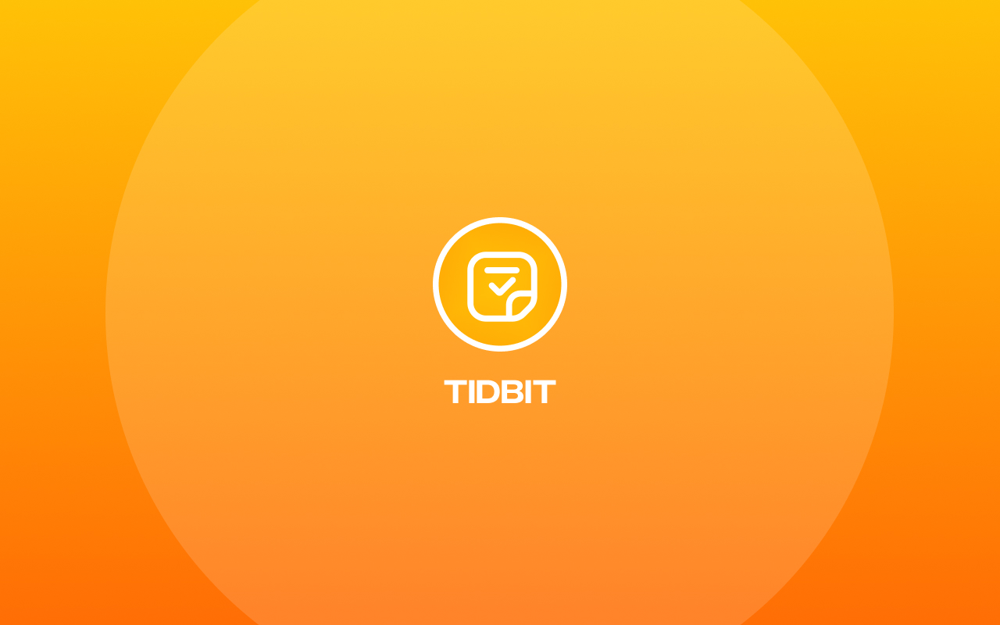

# [TidBit](https://harsh98trivedi.github.io/TidBit) — Notes & Reminders (Svelte)

TidBit is a minimalist, glassmorphic **notes & todo** app built with **Svelte + Vite**, designed as a personal, offline-friendly alternative to Google Keep.

You can create rich notes with formatting, tags, color labels and reminders — all stored locally in your browser.

Live demo: **https://harsh98trivedi.github.io/TidBit/**

## [](https://harsh98trivedi.github.io/TidBit)

## ✨ Features

- 📝 **Rich notes**
  - Title + full note body
  - Rich text editor: bold, italic, underline, headings, lists, quotes, alignment
  - Insert links and images (URL or local upload)
- 🔡 **Markdown mode**
  - Switch between rich-text and markdown
  - Quick helpers for bold/italic, links, images, code, quotes, lists
- 🏷 **Tags & filters**
  - Add tags to notes
  - Click tags to filter quickly
  - Dedicated tag filter bar (All / specific tags)
- 🎨 **Color labels**
  - Choose from multiple color palettes (mint, sun, rose, lavender, sky, slate)
  - Helps visually separate notes by context or priority
- 📌 **Pin & complete**
  - Pin important notes to keep them at the top
  - Mark notes as done without deleting them
- ⏰ **Reminders & notifications**
  - Set reminder date & time per note
  - Browser notifications (with permission)
  - “Test notifications” button in the header
- 💾 **Local persistence**
  - Data stored in `localStorage`
  - Stays until you manually clear browser storage
- 🎭 **UI & UX**
  - Glassmorphic aesthetic
  - Responsive layout (desktop → tablet → phone)
  - Small GSAP micro interactions (card hover/entrance)
  - Accessible (keyboard friendly, reduced-motion aware)

---

## 🧱 Tech Stack

- [Svelte](https://svelte.dev/) + [Vite](https://vitejs.dev/)
- [Font Awesome](https://fontawesome.com/) for icons
- [GSAP](https://greensock.com/gsap/) for subtle animations
- [marked](https://marked.js.org/) for markdown rendering
- Plain old Web APIs:
  - `localStorage` for persistence
  - Notifications API for reminders
  - Service Worker for basic offline support

---

## 📂 Project Structure

```text
.
├── README.md
├── index.html
├── package.json
├── package-lock.json
├── public
│   ├── meta.jpg
│   ├── sw.js
│   ├── tidbit.png
│   └── tidbit.svg
├── src
│   ├── App.svelte
│   └── main.js
├── dist               # build output (generated by Vite)
│   ├── 404.html
│   ├── index.html
│   ├── assets/...
│   ├── sw.js
│   ├── tidbit.png
│   └── tidbit.svg
└── vite.config.js
```

> You don’t need to commit dist/ for GitHub Pages if you use Actions.
> It’s shown here just to document the final output shape.

## 🚀 Getting Started (Local)

### 1. Install dependencies

```
npm install
```

### 2. Run the dev server

```
npm run dev
```

> Then open the URL printed in the terminal

### 3. Build for production

```
npm run build
```

### 4. Preview the production build (optional)

```
npm run preview
```

## 🌐 Deployment (GitHub Pages)

This repo is set up to deploy to GitHub Pages at: [https://harsh98trivedi.github.io/TidBit/](https://harsh98trivedi.github.io/TidBit/)

### Key pieces:

Vite base path in vite.config.js is set to:

```
// vite.config.js
import { defineConfig } from "vite";
import { svelte } from "@sveltejs/vite-plugin-svelte";

export default defineConfig({
  plugins: [svelte()],
  base: "/TidBit/", // must match the repo name on GitHub
});
```

A GitHub Actions workflow (in .github/workflows/deploy.yml) does:

- npm ci
- npm run build
- Uploads dist as the Pages artifact
- Deploys to GitHub Pages

### One-time setup

1. Push the repo to GitHub as `harsh98trivedi/TidBit`.
2. In the repo:
   - Go to Settings → Pages
   - Under Build and deployment, choose GitHub Actions.
3. Push to the `master` branch.
4. Wait for the Deploy TidBit to GitHub Pages workflow to complete.
5. After that, every push to `master` automatically updates:

## 🔔 Notifications & Permissions

- Notifications require HTTPS and user permission.
- GitHub Pages is HTTPS, so it works out of the box.
- Use the bell icon in the header to trigger a test notification:
  - If permission is not yet granted, the browser prompts you.
  - If notifications are blocked, you may need to allow them from site settings.

## .

🛠 Customization

- Branding: edit the app name, logo, and footer in `App.svelte`.
- Colors: tweak the `[data-color="..."]` CSS rules for card backgrounds.
- Animations: adjust or remove GSAP animations in App.svelte if you prefer a calmer UI.
- Markdown: change how markdown is rendered by adjusting the `renderHTML` helper and `marked` options.

## 🔒 Privacy

- TidBit is fully client-side:
  - No accounts, no backend.
  - All data lives in your browser’s storage (and optional service worker cache).
  - Clearing your browser data will permanently remove your notes.

### Contact

- 🌐 **Website**: [harsh98trivedi.github.io](https://harsh98trivedi.github.io)
- 📧 **Email**: hi@harshtrivedi.in
- 🐙 **GitHub**: [@harsh98trivedi](https://github.com/harsh98trivedi)
- 🐦 **Twitter**: [@harsh98trivedi](https://twitter.com/harsh98trivedi)

## 📄 License

This project is licensed under the **The Unlicense license** - see the [LICENSE](LICENSE) file for complete details.

---

<div align="center">
  
  **Made with ❤️ by [Harsh Trivedi](https://harsh98trivedi.github.io/)**
  
  ⭐ **Star this repo** if you found it helpful!
  
  [](https://github.com/harsh98trivedi/TidBit/stargazers)
  [](https://github.com/harsh98trivedi/TidBit/network)
  
</div>
